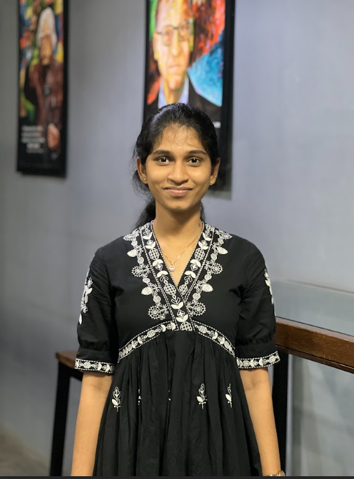

# Aishwarya Ganga VN | Data Analyst Portfolio

## 🚀 Overview

A modern, high-performance portfolio website built to showcase my data analysis projects, skills, and professional experience. Designed with a focus on interactivity and aesthetics, it features immersive 3D visualizations, smooth animations, and a fully responsive layout.

**Live Demo:** https://aishwaryaganga.vercel.app/



## ✨ Key Features

- **Global 3D Ecosystem**: Seamless Neural Mesh and Floating Data Cubes that persist across the entire site for an immersive deep-space feel.
- **Refined Glassmorphism UI**: High-end "Cool & Elegant" aesthetic with subtle Electric Blue glow effects and washout-free transparency.
- **Advanced Mobile UX**: Optimized layout with vertically stacked certifications and touch-friendly interactions.
- **Performance Optimized**: Built with Next.js App Router for fast loading, SEO benefits, and smooth transitions.
- **Dynamic Content**: Modular, data-driven sections for Experience, Projects, Skills, and Education.

## 🛠️ Tech Stack

- **Framework**: [Next.js 15](https://nextjs.org/) (App Router)
- **Language**: [TypeScript](https://www.typescriptlang.org/)
- **Styling**: [Tailwind CSS](https://tailwindcss.com/)
- **3D Graphics**: [Three.js](https://threejs.org/) & [React Three Fiber](https://docs.pmnd.rs/react-three-fiber)
- **Animations**: [Framer Motion](https://www.framer.com/motion/)
- **Icons**: [Lucide React](https://lucide.dev/)

## 🏗️ Getting Started

### Prerequisites

Ensure you have the following installed:
- [Node.js](https://nodejs.org/) (v18 or higher)
- [npm](https://www.npmjs.com/) or [yarn](https://yarnpkg.com/)

### Installation

1.  **Clone the repository:**
    ```bash
    git clone https://github.com/AishwaryaGangaVN/personal_portfolio.git
    cd personal_portfolio
    ```

2.  **Install dependencies:**
    ```bash
    npm install
    # or
    yarn install
    ```

3.  **Run the development server:**
    ```bash
    npm run dev
    # or
    yarn dev
    ```

4.  Open [http://localhost:3000](http://localhost:3000) with your browser to see the result.

## 📂 Project Structure

```
src/
├── app/              # Next.js App Router pages and layout
├── components/       # Reusable UI components
│   ├── 3d/           # Three.js 3D scenes (NeuralField, FloatingCubes)
│   ├── sections/     # Page sections (Hero, About, Projects, etc.)
│   └── ui/           # Generic UI elements (Navbar, Cards, Buttons)
├── lib/              # Utility functions, constants, and animation variants
└── ...
```

## 📬 Contact

I'm always open to discussing new opportunities and interesting projects.

- **Email**: [aishwaryaganga2004@gmail.com](mailto:aishwaryaganga2004@gmail.com)
- **LinkedIn**: [Aishwarya Ganga VN](https://www.linkedin.com/in/aishwarya-ganga-vn/)
- **GitHub**: [AishwaryaGangaVN](https://github.com/AishwaryaGangaVN)

---

Developed with ❤️ by Aishwarya Ganga VN
